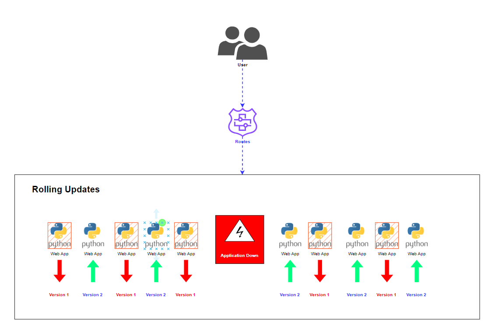

# I. Kubernetes Deployment strategies
## 1. [Recreate]()

- A recreate deployment strategy is an all-or-nothing process that lets you update an application immediately, with some downtime. 

- With this strategy, existing pods from the deployment are terminated and replaced with a new version. This means the application experiences downtime from the time the old version goes down until the new pods start successfully and start serving user requests. 

- A recreate strategy is suitable for development environments, or when users prefer a short period of downtime rather than a prolonged period of reduced performance or errors (which might happen in a rolling deployment). The bigger the update, the more likely you are to experience errors in rolling updates.

- Additional scenarios where a recreate deployment is appropriate: 

    - You have the ability to schedule planned maintenance during off times (for example, during the weekend for an application only accessed during business hours). 
    - For technical reasons it is impossible to have 2 versions of the same app running at the same time. A recreate deployment lets you shut down the previous version and only then start the new one.
## 2. [Rolling Update]()

- Rolling deployment is a deployment strategy that updates a running instance of an application to a new version. All nodes in the target environment are incrementally updated to a new version; the update occurs in pre-specified batches. This means rolling deployments requires two versions of a Service—one for the old version and another for the new version of the application.

- The advantages of a rolling deployment are that it is relatively easy to roll back, is less risky than a recreate deployment, and is easier to implement.

- The downsides are that it can be slow, and there is no easy way to roll back to the previous version if something goes wrong. Also, it means your application might have multiple versions running at the same time in parallel. This might be problematic for legacy applications, which might force you to use a recreate strategy.
## 3. [Blue-Green Deployment]()

- A blue/green (or red/black) deployment strategy enables you to deploy a new version while avoiding downtime. Blue represents the current version of the application, while green represents the new version. 

- This strategy keeps only one version live at any given time. It involves routing traffic to a blue deployment while creating and testing a green deployment. After the testing phase is concluded, you start routing traffic to the new version. Then, you can keep the blue deployment for a future rollback or decommission it. 

- A blue/green deployment eliminates downtime and reduces risk because you can immediately roll back to the previous version if something occurs while deploying the new version. It also helps avoid versioning issues because you change the entire application state in one deployment. 

- However, this strategy requires double resources for both deployments and can incur high costs. Furthermore, it requires a way to switch over traffic rapidly from blue to green version and back.
## 4. [Canary Deployment]()

- A canary deployment strategy enables you to test a new application version on a real user base without committing to a full rollout. It involves using a progressive delivery model that initiates a phased deployment. Canary deployment strategies encompass various deployment types, including A/B testing and dark launches.

- Typically, a canary strategy gradually deploys a new application version to the Kubernetes cluster, testing it on a small amount of live traffic. It enables you to test a major upgrade or experimental feature on a subset of live users while providing all other users with the previous version.

- A canary deployment requires using two almost identical ReplicaSets – one for all active users and another rolling out new features to a small subset of users. Once confidence increases in the new version, you can gradually roll it out to the entire infrastructure. This process ends with all live traffic going to canaries until the canary version becomes the new production version.

- Like in a blue/green deployment, there are two disadvantages: the application needs to be able to run multiple versions at the same time, and you need to have a smart traffic mechanism that can route a subset of requests to the new version.

# II. Which Strategy to Choose?
* The following table summarizes deployment strategies and their pros and cons, to help you choose the best strategy for your use case.

|Deployment Strategy|Available in K8s out of the box?|Pros|
|---|---|---|
|Recreate|Yes| Fast and consistent.|
|RollingUpdate|Yes| 	Minimizes downtime, provides security guarantees.|
|Blue/Green|No| No downtime and low risk, easy to switch traffic back to the current working version in case of issues.|
|Canary|No| Seamless to users, makes it possible to evaluate a new version and get user inputs with low risk.|